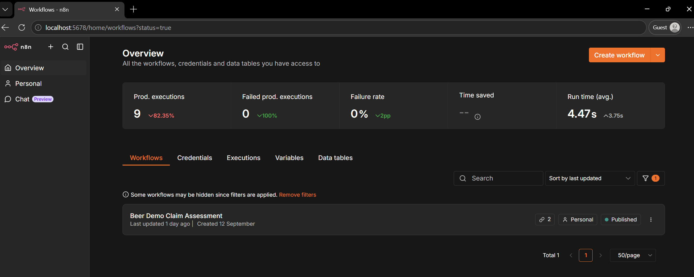
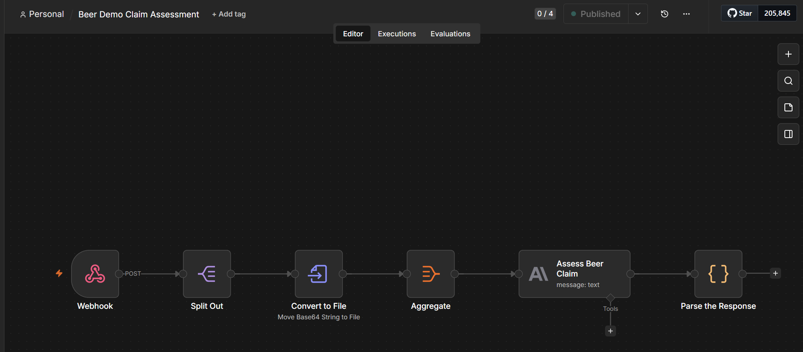

# N8N Workflow Flow

## Overview

This document describes the N8N workflow automation for the Claims Management System. The primary workflow is **"Beer Demo Claim Assessment"** which uses AI-powered analysis via Claude to assess beer claims with evidence validation.

## N8N Overview



## Workflow: Beer Demo Claim Assessment

This workflow automates the assessment of beer claims by analyzing claim details against provided evidence (images and documents).

### Workflow Diagram



## Workflow Steps

### 1. Webhook Trigger
- **Node**: `Webhook`
- **Description**: Receives claim submission requests via HTTP POST
- **Endpoint**: `POST /submitClaimReview`
- **Authentication**: Basic Auth (Beer Demo User credentials)
- **Input**: Claim data including type, impacted beers, defects, description, and evidence attachments

### 2. Split Out Attachments
- **Node**: `Split Out`
- **Description**: Extracts evidence attachments from the claim payload
- **Output**: Individual attachment records with metadata

### 3. Convert to File
- **Node**: `Convert to File`
- **Description**: Converts attachment streams to binary files
- **Process**: Preserves file names and MIME types (e.g., image/jpeg)

### 4. Aggregate Binary Data
- **Node**: `Aggregate`
- **Description**: Consolidates all binary attachments for AI processing
- **Output**: Aggregated binary data ready for Claude assessment

### 5. Claude AI Assessment
- **Node**: `Assess Beer Claim`
- **Model**: Claude Haiku 4.5
- **Description**: Analyzes claim consistency with evidence using AI
- **Analysis Includes**:
  - Claim type validation
  - Impacted beer identification
  - Primary and secondary defect consistency
  - Evidence image analysis (looking for beer names, damage, defects)
  - Text matching in images against claim details
  - Overall consistency scoring

### 6. Parse Response
- **Node**: `Parse the Response`
- **Description**: Extracts JSON response from Claude's markdown-formatted output
- **Output Format**:
  ```json
  {
    "outcome": 85,
    "report": "Detailed assessment report..."
  }
  ```
## Workflow Output

### Success Response
The workflow returns a JSON response with:
- **outcome** (integer 0-100): Confidence score on claim consistency
- **report** (string): Detailed assessment explaining:
  - Alignment between claim details and evidence
  - Specific observations from images
  - Text matching against beer names
  - Any uncertainties or missing information

### Example Response
```json
{
  "outcome": 92,
  "report": "Claim assessment completed by agent. Strong consistency between claim details and evidence provided. Image clearly shows an 'OLD MONEY' beer bottle matching the impacted beer name. The label displays 'DECEMBER 2018 VINTAGE' prominently..."
}
```

## Configuration

### Required Credentials

1. **Basic Auth (Beer Demo User)**
   - **Purpose**: Secures the webhook endpoint
   - **Setup**: Created as "Beer Demo User" in N8N
   - **Usage**: Required for webhook authentication

2. **Claude/Anthropic API**
   - **Purpose**: Powers the AI claim assessment
   - **Credential Name**: "Beer Demo Anthropic"
   - **Setup**: 
     ```bash
     pnpm run n8n:import:creds:beer_demo_anthropic
     ```
   - **Required**: Valid Anthropic API key with Claude Haiku 4.5 access
   - **Model**: `claude-haiku-4-5-20251001`

### Environment Variables

- `N8N_WEBHOOK_URL`: Base URL for the N8N instance (e.g., `http://localhost:5678`)
- `GENERIC_TIMEZONE`: Timezone for N8N execution (e.g., "Australia/Brisbane")
- `N8N_RUNNERS_ENABLED`: Set to true to enable N8N runners for distributed execution

### Node Configuration

**Assess Beer Claim Node**:
- Model: `claude-haiku-4-5-20251001`
- Max Tokens: 1024
- Attachments Enabled: Yes (Binary mode)
- Binary Property: Dynamically mapped from aggregated attachments

## Testing

### Test File Location

All test requests are defined in: [`n8n/test/n8n-beer-claim.http`](../n8n/test/n8n-beer-claim.http)

This file contains pre-configured HTTP requests that can be executed directly from VS Code using the REST Client extension.

### Prerequisites for Testing

- N8N instance running at `http://localhost:5678`
- Claude API credentials configured in N8N
- Basic auth credentials configured (`n8n_wf_user:n8n_wf_user`)
- REST Client extension installed in VS Code (or use curl/Postman)

### Available Test Cases

#### 1. Quality Claim with Single Attachment
- **File**: `n8n-beer-claim.http` - "Trigger Webhook using Basic Auth with one attachments"
- **Tests**: Appearance defect (Discolouration, Poor Carbonation) claim
- **Beer**: Twofold WCIPA
- **Evidence**: Single damage image (ColaCanCrushed.jpeg)
- **Expected**: AI assessment of visual damage consistency

#### 2. Quality Claim with Multiple Attachments  
- **File**: `n8n-beer-claim.http` - "Trigger Webhook using Basic Auth with two attachments"
- **Tests**: Expiry defect claim (Past Expiry)
- **Beer**: Old Money
- **Evidence**: Two images - label (OldMoney1.jpg) and damage (OldMoney2.jpg)
- **Expected**: AI assessment with label text matching and vintage date validation

#### 3. Workflow Details via REST API
- **File**: `n8n-beer-claim.http` - "Get Workflow Details via REST API"
- **Purpose**: Retrieve workflow configuration and metadata
- **Requires**: N8N API key

### Running Tests in VS Code

1. Install the [REST Client](https://marketplace.visualstudio.com/items?itemName=humao.rest-client) extension
2. Open the test file: `n8n/test/n8n-beer-claim.http`
3. Click "Send Request" above each test case
4. Review the response in the output panel

### Running Tests with cURL

```bash
# Test with single attachment
curl -X POST http://localhost:5678/webhook-test/submitClaimReview \
  -H "Content-Type: application/json" \
  -u "n8n_wf_user:n8n_wf_user" \
  -d @payload_single_attachment.json

# Test with multiple attachments
curl -X POST http://localhost:5678/webhook-test/submitClaimReview \
  -H "Content-Type: application/json" \
  -u "n8n_wf_user:n8n_wf_user" \
  -d @payload_multiple_attachments.json
```

### Expected Response Format

All test requests should receive:
```json
{
  "outcome": 0-100,
  "report": "Detailed assessment explanation..."
}
```


