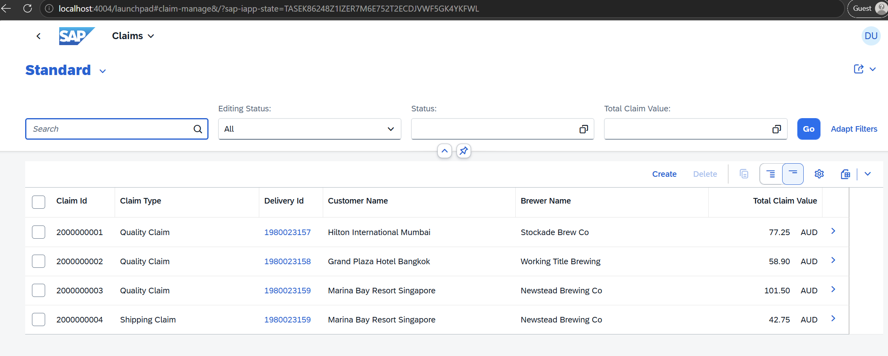
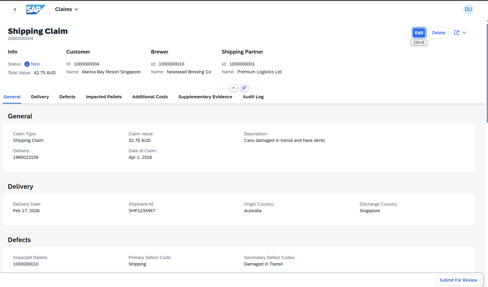
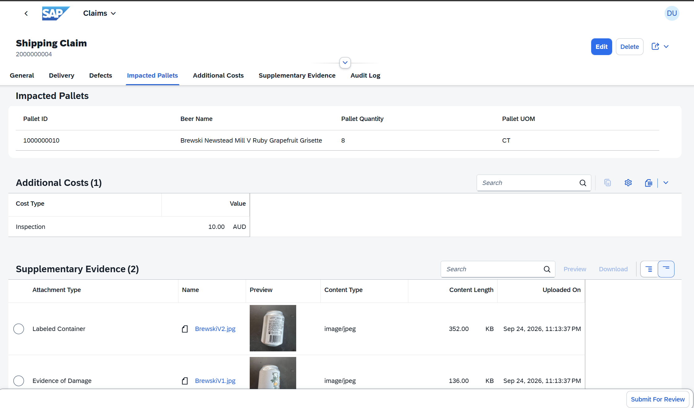
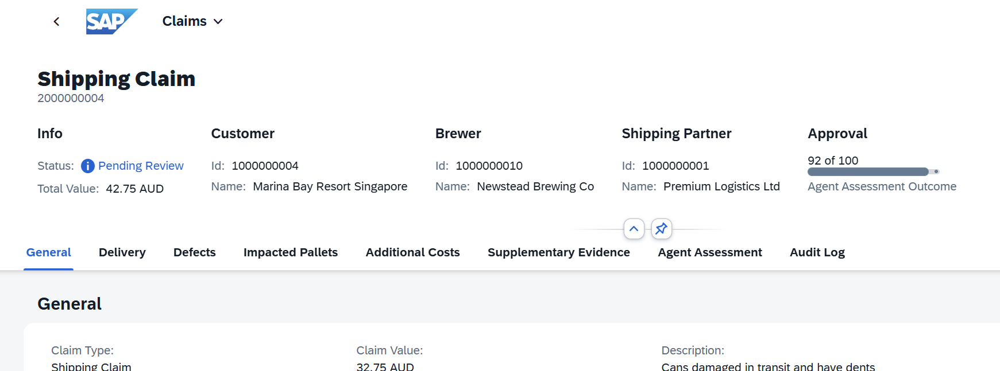
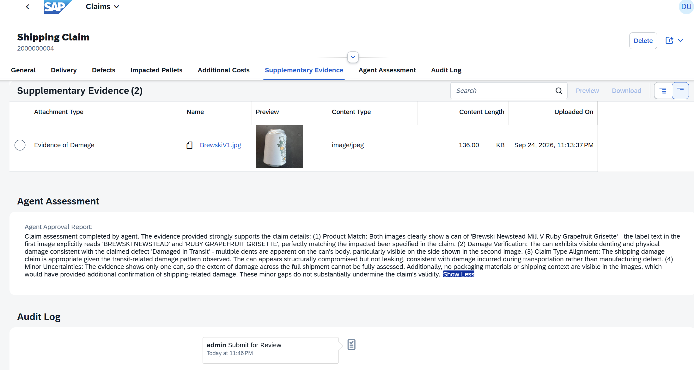

# SAP UI5 Applications

## Overview

The Claims N8N Demo includes three SAPUI5 applications built on the CAP backend for managing beer claims, deliveries, and configurations. This document focuses on the **Claims Processing Application**, which is the core application for managing beer quality and logistics claims.

## Accessing the Applications

All applications are available through the [UI5 Launchpad](http://localhost:4004/launchpad#Shell-home) or directly via:

- **Claims App**: `http://localhost:4004/app/claims/`
- **Beers App**: `http://localhost:4004/app/beers/`
- **Deliveries App**: `http://localhost:4004/app/deliveries/`

**Default Credentials:**
- Username: `admin`
- Password: `admin`

## Claims Processing Application

The Claims Processing Application is the primary workflow for submitting, reviewing, and managing beer claims with AI-assisted agent assessment.

### Claim Submission Scenario

This section walks through the complete claim submission and assessment workflow using the UI5 Claims application.

#### Step 1: Claim Header Information

When creating or viewing a claim, the header displays:
- **Claim ID**: Unique identifier for the claim
- **Claim Type**: Classification (QC, SH, PK, etc.)
- **Date of Claim**: When the claim was submitted
- **Status**: Current claim processing status
- **Description**: Brief summary of the claim issue
- **Total Claim Value**: Financial amount requested

Key fields to fill when creating a new claim:
- Claim type (Quality Control, Shipping, Packaging, etc.)
- Claim date
- Primary defect code
- Description of the issue

#### Step 2: Claim Details and Attachments

The details section includes:
- **Impacted Pallets**: Beer pallets affected by the claim
  - Beer name and SKU
  - Quantity and unit of measure
  - Delivery information
- **Secondary Defects**: Additional defect classifications
- **Attachments Section**: Evidence files supporting the claim
  - Upload images of the damage or quality issue
  - Attach documentation (receipts, quality reports, etc.)
  - Supported formats: JPEG, PNG, PDF
  - Each attachment shows file name, type, and size

Important: Quality evidence images are critical for the N8N agent assessment. Ensure clear, well-lit images that show:
- Product damage or defect clearly
- Beer labels for identification
- Any relevant packaging or container information

#### Step 3: Submit for Agent Review

To submit a claim for N8N agent review:
1. Complete all required fields in the claim header
2. Add impacted pallets with accurate beer names
3. Select appropriate primary and secondary defects
4. Attach evidence images (minimum recommended: 1-2 images)
5. Click "Submit for Agent Review"

The application will send the claim data and attachments to the N8N workflow for AI-powered assessment via Claude.

#### Step 4: Agent Assessment Results

After the N8N workflow processes the claim:
- **Agent Approval Outcome**: Confidence score (0-100) indicating claim validity
  - 0-30: Low confidence
  - 31-70: Medium confidence
  - 71-100: High confidence
- **Agent Approval Report**: Detailed analysis including:
  - Consistency assessment between claim details and evidence
  - Specific observations from attached images
  - Text matching (e.g., beer names visible in images)
  - Any uncertainties or additional observations

The assessment helps reviewers validate claims quickly with AI-assisted analysis.

#### Step 5: Complete Assessment Workflow

Once assessment is complete:
- Claim status updates to reflect agent assessment results
- Review team can make approval/rejection decisions based on the outcome score
- Additional actions can be taken:
  - Approve claim for credit note
  - Request additional evidence if needed
  - Reject with explanation
  - Mark as pending for manual review

## Integration with N8N

The Claims application integrates seamlessly with the N8N workflow engine:

1. **Claim Submission**: User submits claim via UI5 interface
2. **Webhook Trigger**: CAP backend calls N8N webhook with claim data
3. **AI Assessment**: Claude Haiku analyzes claim vs. evidence
4. **Result Storage**: Assessment outcome and report stored in database
5. **UI Update**: Claims app displays agent assessment results

See [N8N Workflow Documentation](./n8n-flow.md) for technical details on the assessment workflow.

## Best Practices for Claim Submission

### Providing Strong Evidence
- Take clear photos in good lighting
- Include beer labels in images for identification
- Show damage/defect clearly and completely
- Use high-quality images (avoid blurry photos)
- Provide multiple angles if damage is complex

### Accurate Claim Information
- Select correct claim type to match the issue
- Use accurate beer names matching product labels
- Specify all impacted items quantity correctly
- Write clear, concise claim description
- Include dates and circumstances of discovery

### Maximizing AI Assessment Score
- Ensure beer names in claim match visible text in images
- Defects visible in images should match primary/secondary codes
- Provide images that clearly show the claimed issue
- Include product labels for identification verification
- Keep descriptions factual and detailed

## User Roles and Permissions

- **Claimant**: Can submit new claims and upload evidence
- **Reviewer**: Can view claims, initiate agent assessment, approve/reject
- **Admin**: Full access to all claims and configuration management
- **Agent (AI)**: N8N workflow that automatically assesses claims

## Related Documentation

- [N8N Workflow Flow](./n8n-flow.md) - AI-powered claim assessment workflow
- [Main README](../readme.md) - Project overview and setup
