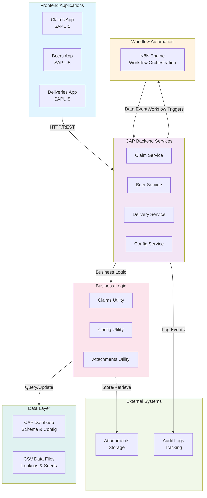

# Claims N8N Demo

[](LICENSE)
[](https://nodejs.org/)
[](https://www.docker.com/)
[]()
[](https://cap.cloud.sap)
[](https://n8n.io/)

## About

This is a comprehensive claims management system built on SAP Cloud Application Programming (CAP) model with integration to N8N for workflow automation. The project demonstrates a multi-app architecture with support for managing beer claims, deliveries, and related configurations.

**Key Features:**
- **Claims Management**: Track and manage beer-related claims with attachments and audit logs
- **Delivery Tracking**: Monitor deliveries and associated shipments
- **Configuration Management**: Centralized configuration and settings management
- **N8N Integration**: Workflow automation for claims processing
- **Multi-App UI**: Separate SAPUI5 applications for beers, claims, and deliveries
- **Comprehensive Data Model**: Support for defects, costs, partners, and audit trails

**Technology Stack:**
- SAP CAP (Cloud Application Programming) for backend
- CDS (Core Data Services) for data modeling
- SAPUI5 for frontend applications
- Node.js for server-side logic
- N8N for workflow orchestration
- Docker for N8N deployment

## Architecture



## Getting Started

### Prerequisites

- **Node.js** and npm/pnpm installed
- **Docker** (for N8N)
- **VS Code** (recommended)

### Quick Start

1. **Install Dependencies**
   ```bash
   pnpm install
   ```

2. **Start the CAP Development Server**
   
   Open a terminal and run:
   ```bash
   cds watch
   ```
   
   Or in VS Code, use: _**Terminal** > Run Task > cds watch_
   
   The server will start on `http://localhost:4004` and watch for file changes.

3. **Access the Applications**
   - Claims App: `http://localhost:4004/app/claims/`
   - Beers App: `http://localhost:4004/app/beers/`
   - Deliveries App: `http://localhost:4004/app/deliveries/`

### Project Structure

File or Folder | Purpose
---------|----------
`app/` | SAPUI5 frontend applications (claims, beers, deliveries)
`db/` | Domain models and data definitions
`srv/` | Service implementations and business logic
`test/` | Test files and sample data
`n8n/` | N8N workflow configurations
`readme.md` | This file

### Development Tips

- Edit your domain model in `db/schema.cds`
- Add service logic in `srv/*.js`
- UI annotations are in `app/*/annotations.cds`
- Sample test data is in `test/data/`
- Use `cds watch` for live reloading during development

## Learn More

Learn more about CAP at <https://cap.cloud.sap>.

## N8N
### Initial Setup

On your first run create a volume 
```
docker volume create n8n_data
```

You can check if you've done this before by running 
```
docker volume ls
```

### Start Locally

1. **Start the N8N Container**

   Use the npm script to start N8N in the background:
   ```bash
   pnpm run n8n:start
   ```

   Or manually with Docker (replace timezone as needed):
   ```bash
   docker run -d \
    --name n8n_beer_demo \
    -p 5678:5678 \
    -e GENERIC_TIMEZONE="Australia/Brisbane" \
    -e TZ="Australia/Brisbane" \
    -e N8N_ENFORCE_SETTINGS_FILE_PERMISSIONS=true \
    -e N8N_RUNNERS_ENABLED=true \
    -v n8n_data:/home/node/.n8n \
    docker.n8n.io/n8nio/n8n
   ```

2. **First Time Setup - Import Workflows & Credentials**

   On your first run, you'll need to import the workflows and credentials:
   ```bash
   pnpm run n8n:import:wf
   pnpm run n8n:import:creds
   ```

   Or import individually:
   ```bash
   pnpm run n8n:import:wf
   pnpm run n8n:import:creds:beer_demo_user
   pnpm run n8n:import:creds:beer_claims_header_auth
   ```

3. **Access N8N**

   N8N will be available at `http://localhost:5678`

   On first login you'll be prompted to create your admin login details. Thereafter you will be prompted to login using those credentials.

### Stop N8N

To stop the N8N container:
```bash
pnpm run n8n:stop
```

### Export Workflows & Credentials

To export your workflows and credentials from N8N back to the n8n directory:
```bash
pnpm run n8n:export:wf
pnpm run n8n:export:creds
```

## Beer Links
https://www.bjcp.org/education-training/education-resources/beer-faults/
